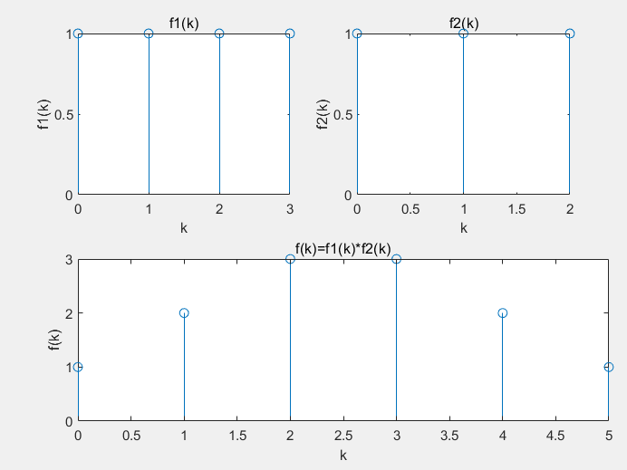
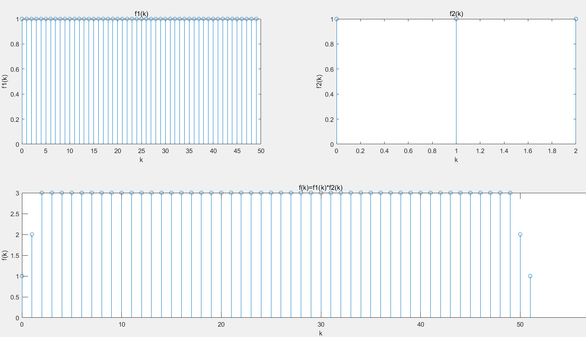
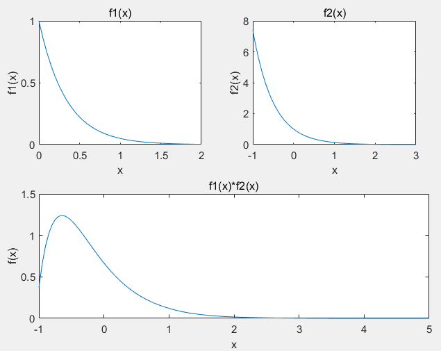

实验人：边润华                                                       学号：20337171

专业：计算机科学与技术                                        班级：系统结构

实验题目：用MATLAB实现计算卷积和                  实验日期：2022年3月6日

## 一、实验目的

* 掌握卷积和的计算机编程方法，利用MATLAB实现两个离散序列的卷积和并绘制图像
* 利用卷积和求离散系统的响应，观察、分析系统的时域特性。
* 将上述方法推广到连续序列的情形。

## 二、实验器材

* 笔记本电脑一台，性能足够强大
* MATLAB R2020b

## 三、实验过程

### 1、上机练习部分

#### 第一题

* 此处还是有必要把例题里面的函数再写一遍，因为后面有作用

* 编写函数`dconv`，目的是一键完成计算卷积和绘图
* 本函数支持输入两个函数及其范围，自动计算出卷积及其范围，并自动作图

```matlab
function [f,k] = dconv(f1,f2,k1,k2)
    f=conv(f1,f2)
    k0=k1(1)+k2(1);
    k3=length(f1)+length(f2)-2;
    k=k0:k0+k3
    subplot(2,2,1)
    stem(k1,f1)
    title('f1(k)')
    xlabel('k')
    ylabel('f1(k)')
    subplot(2,2,2)
    stem(k2,f2)
    title('f2(k)')
    xlabel('k')
    ylabel('f2(k)')
    subplot(2,2,3)
    stem(k,f)
    title('f(k)=f1(k)*f2(k)')
    xlabel('k')
    ylabel('f(k)')
    h=get(gca,'position');
    h(3)=2.5*h(3);
    set(gca,'position',h)
end
```

#### 第二题

* 依次输入如下命令

```matlab
>> k1=0:3;
>> k2=0:2;
>> f1=[1,1,1,1];
>> f2=[1,1,1];
>> dconv(f1,f2,k1,k2)
```

* 输出结果如下

```matlab
f =
     1     2     3     3     2     1

k =

     0     1     2     3     4     5

ans =

     1     2     3     3     2     1
```

* 图片的截图如下。完整图片见`Fig2-1.fig`



#### 第三题

* 此时因为时间序列无限长，我们只得保留部分样点，比如50个（事实上这个时候转变成了$h(k)=u(k)-u(k-50)$）
* 于是命令如下

```matlab
>> k1=0:49;
>> k2=0:2;
>> f1=ones(1：50);
>> f2=[1,1,1];
>> dconv(f1,f2,k1,k2)
```

* 结果截图如下，完整结果见`Fig2-2.fig`



### 2、思考题

#### 第一题

* 不全是真实的。显然当k>=50时结果就不对了。这是因为我们的h(k)只取了k<=49，所以k>=50的结果一定就不对了。

#### 第二题

* 本题我们仍然是构建一个函数来计算连续信号的卷积的近似值。
* 该函数需要是函数句柄（`function_handle`),但是返回值仍然只能是一个点集（考虑到两个初等函数求卷积未必是初等函数）。
* 思想方法：由$f(t)=f_1(t)*f_2(t)=\int^{+\infty}_{-\infty}f_1(\tau)f_2(t-\tau)d\tau={\Delta}lim_{\Delta->0}\sum^{+\infty}_{-\infty}f_1(k\Delta)f_2(t-k\Delta)$,就完成了离散化。就可以计算了。

```matlab
function [f,l,r] = cconv(f1,f2,l1,r1,l2,r2,d)
%计算连续函数的卷积
%f:计算结果
%l:f范围的左端点
%r:f范围的右端点
%f1:信号1(函数句柄）
%f2:信号2（函数句柄）
%l1:函数1左端点
%r1:函数1右端点
%l2:函数2左端点
%r2:函数2右端点
%d:取样间距
    l=l1+l2					％左端点
    r=r1+r2					％右端点
    x=l:d:r;				％区间构造
    x1=l1:d:r1;
    x2=l2:d:r2;
    fd1=f1(x1);				％离散化
    fd2=f2(x2);
    f=d*conv(fd1,fd2);		％计算卷积

    subplot(2,2,1);				
    plot(x1,f1) 
    title('f1(x)')
    xlabel('x')
    ylabel('f1(x)')
    subplot(2,2,2);
    plot(x2,f2) 
    title('f2(x)')
    xlabel('x')
    ylabel('f2(x)')
    subplot(2,2,3);
    plot(x,f); 
    title('f1(x)*f2(x)')
    xlabel('x')
    ylabel('f(x)')
    h=get(gca,'position');
    h(3)=2.5*h(3);
    set(gca,'position',h)
end
```

* 接下来我们举一个例子来进行计算$f1*f2$,其中$f1(t)=e^{-3t}(0<t<2),f2(t)=e^{-2t}(-1<t<3)$,采样间距0.05

```matlab
f1=@(x)exp(-3*x);
f2=@(x)exp(-2*x);
cconv(f1,f2,0,2,-1,3,0.05)
```

* 截图如下。完整图片见`Fig2-3.fig`




## 四、实验总结

* 本次实验是真正开始学习用MATLAB解决问题。可以看出MATLAB的计算能力是很强大的。这些问题手算需要比较长的时间，但是使用MATLAB可以瞬间得到结果。
* 作为离散情况，直接一个自带公式就可以解决问题。但是需要通过一些手段确定范围。对于连续情况可以通过取样转化为离散情况，再进行计算。这也符合数学分析课程中用离散量逼近连续量的极限思想。
* 总体上来说这个实验难度是不大的。函数句柄之类的东西，上次数学建模的时候已经折腾过。所以很快也就实现了。
* 考虑到计算机性能不同，在连续函数那一个任务中设计了步长参数，步长越小就越精确但是计算速度也就越慢。
