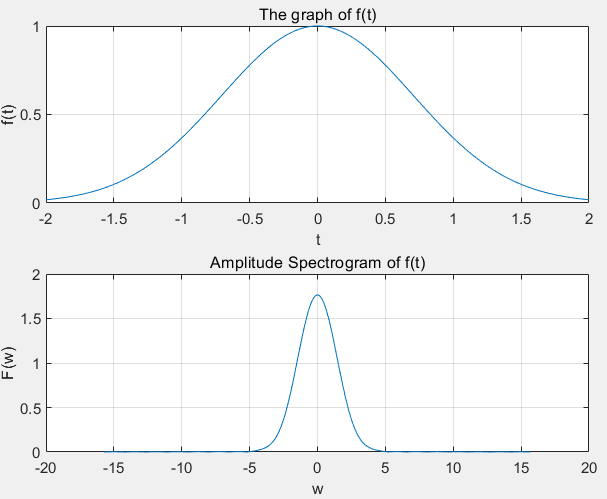

# 信号与系统实验报告3

专业：计算机科学与技术                                        班级：系统结构

实验题目：用MATLAB进行计算连续时间信号、系统的频域分析             

实验日期：2022年3月31日

## 一、实验目的

* 熟悉傅里叶变换的性质
* 熟悉常见信号的傅里叶变换 
* 了解傅里叶变换和反变换的 MATLAB 实现方法
* 学会用 MATLAB 分析 LTI 系统的频域特性
* 学会用 MATLAB 分析 LTI 系统的输出响应

## 二、实验器材

* 笔记本电脑一台，性能足够强大
* MATLAB R2020b

## 三、实验过程

### 1、实验原理

本部分讲解一些实验原理和基本方法，用以完成后面几个题目

#### 用专用函数求解傅里叶变换和傅里叶反变换

* `fourier`函数可以用来求傅里叶变换，`ifourier`函数可以用来求傅里叶反变换
* `fourier`函数默认变量为t，返回函数的默认变量为w。可以自定义。
* `                                                                                                                                                                                                                                                                                                                                                                                                                                                                                                                                                                                                                                                                                                                                                                                                                                                            ifourier`函数默认变量为w，返回函数的默认变量为x，可以自定义
* 在使用以上两个函数时，输入函数里的变量要用`syms`命令定义。函数要用`sym`说明为符号表达式（而非点集或函数句柄）
* 对于符号表达式，作图要用`ezplot`工具。
* 对于符号表达式，如果里面存在奇异函数(譬如`δ(x)`),那么将会画不出图。可以将其转换为分段函数，以下命令将函数F转化为分段函数FF

```matlab
FF=maple('convert',F,'piecrwise')
```

* 用`abs`函数将复变函数结果转化为其模
* 有时可以使用`simplify`函数将表达式进行化简

#### 用数值计算求解傅里叶变换和傅里叶反变换

* 上面已经提到，专用函数求傅里叶变换有其局限性。如果函数本身不能用解析式表示，就无法计算其傅里叶变换。这个时候就可以用数值计算方法来计算

* 傅里叶变换的计算公式如下
  * w就是ω，不知道咋地公式块失灵了

$$
F(jw)=\int^{+\infty}_{-\infty}f(t)e^{-jwt}dt=lim_{\tau-0}\sum^{\infty}_{n=-\infty}f(n\tau)e^{-jwn\tau}\tau
$$

* 如果f(t)的范围是有限的，或者在|t|大于某个值的时候|f(t)|已经很小，那么n就范围有限了。那么上面的式子转化为

$$
F(jw)=\tau\sum^{N-1}_{n=0}f(n\tau)e^{-jwn\tau}
$$

* 同样可以对w进行取样，得
  * M是采样数，w~0~是频率范围

$$
G(k)=F(jw_k)=\tau\sum^{N-1}_{n=0}f(n\tau)e^{-jw_kn\tau},0<k<M,w_k=\frac{w_0}{M}k=\frac{2\pi}{M\tau}k
$$

* 那么，我们可以看出，f(nτ)是一个1\*n矩阵，w是一个1\*M矩阵、nτ是一个1\*n矩阵。最后结果是1\*m矩阵，那么以上公式的求法就很简单了。(分别以FWTG代表四个矩阵)

$$
G=\tau Fexp(-jT'W)
$$

* 此时注意，取样频率`2pi/τ`必须大于奈奎斯特频率，也即目标最大采样频率的二倍
* 对于实信号，频谱一定是个偶函数，所以画频谱图的时候，只需要先把正半轴算出来，然后对称一下。借助于y轴对称函数`fliplr`，可实现这一点。

#### 用MATLAB分析LTI系统的频域特性

*  如果系统的频率响应H(jw)是jw的有理分式时，可以用`freqs`命令计算其频域特性
* 该函数格式形如`freqs(b,a,w)`,a是分母的系数向量，b是分子的系数向量，h是取样点向量
* 用`abs`获得幅度特性，用`angle`获取相位特性

### 2、用数值计算方法求幅度频谱

* 本题有四个函数要求频谱。比较好的办法是构建一个函数，来完成所有的事情。我们先要抽象出需要的输入数据。
  * 取样间隔，时间样值和函数样值（注意统一，生成方法可以手动也可以函数句柄）
  * 频率采样数和频率范围
  * 编写的函数`NumericFourier.m`如下

```matlab
function [] = NumricFourier(dt,t,ft,M,w0)
%数值计算傅里叶变换并画图
%   dt:采样间隔
%   t:时间样值
%   ft:函数样值
%   M:频率取样数
%   w0:频率取样范围
k=0:M;
w=k*w0/M;
Fw=abs(ft*exp(-1i*(t')*w)*dt);
W=[-fliplr(w),w(2:M+1)];
FW=[fliplr(Fw),Fw(2:M+1)];
subplot(2,1,1);
plot(t,ft);
grid on;
xlabel('t');
ylabel('f(t)');
title('The graph of f(t)');
subplot(2,1,2);
plot(W,FW);
grid on;
xlabel('w');
ylabel('F(w)');
title('Amplitude Spectrogram of f(t)');
end
```

* 先用例子程序试一下。有`dt=0.02`,`t=-2:0.02:2`,`f=[50个0,101个1,50个0]`,`M=500`,`w0=10pi`
* 命令行如下:

```matlab
>> dt=0.02;
>> t=-2:0.02:2;
>> ft=[zeros(1,50),ones(1,101),zeros(1,50)];
>> M=500;
>> w0=10*pi;
>> NumricFourier(dt,t,ft,M,w0)
```

* 图像如下（需要此图像和后面的图像对比），完整图像见`Fig1.fig`


#### (1) f(t)=u(2t+1)-u(2t-1)

* 这个函数是一个门宽为1的门函数。第一个过零点频率是2pi，我们仿照例题，令`dt=0.01`,`t=-1:0.01:1`,`f=[50个0,101个1,50个0]`,`M=500`,`w0=20pi`
* 截图如下。完整图片见`Fig2.fig`
  * 可以发现横坐标拉一倍，纵坐标压一半。
  * 也即后者是前者的频域扩张的结果，且扩张了一倍。


#### （2）三角脉冲

* 本题我们取和例题相同的参数（因为非零区间的长度也是2）,唯一的区别是函数构造为`ft=[zeros(1,50),0:0.02:1,0.98:-0.02:0,zeros(1,50)]`
* 截图如下，完整图见`Fig3.fig`


#### (3)单边指数信号f(t)=u(t)exp(-t)

* 本题虽然非零区间的长度是无穷的，但是我们发现exp(-4)<0.02，说明我们可以取函数在[0,4]内的值，可以求出近似解。仍然令w0=10pi，这样在边界处，F(w)只有0.03.
* 截图在下面，完整图见`Fig4.fig`


#### (4)高斯函数f(t)=exp(-t^2^)

* 和上一个问题类似，函数的非零区间是无穷的，但是当|t|>2 时函数值小于0.02，所以可以画出[-2,2]区间内的函数图像。并进行计算。
  * 因为这一次频谱比较窄，所以可以取w0=5*pi
* 图像见下图，完整图像见`Fig5.fig`



### 3、用专用函数求傅里叶反变换

#### （1）问题1

```matlab
>> syms t w
>> Fw=sym(-2*w*1i/(16+w^2));
>> ft=ifourier(Fw,w,t)
 
ft =
 
exp(-4*abs(t))*sign(t)
```

* 可知，本题的计算结果为

$$
f(t)=sgn(t)*e^{-4|t|}
$$

#### (2)问题2

```matlab
>> Fw=sym(((i*w)^2+5*i*w-8)/((i*w)^2+6*i*w+5))
 
Fw =
 
-(w^2 - w*5i + 8)/(- w^2 + w*6i + 5)
 
>> ft=simplify(ifourier(Fw,w,t))
 
ft =
 
dirac(t) - (exp(-5*t)*(sign(t) + 1)*(3*exp(4*t) - 2))/2
```

* 可知，本题的计算结果为

$$
f(t)=\delta(t)-\frac{(sgn(t)+1)}{2}e^{-5t}(3e^{4t}-2)
$$


### 4、求有理分式形式的频率响应的幅度和相位特性

* 事实上本题也可以写一个函数，把`freqs`功能和作图功能封装起来
  * 如果MATLAB不是很新，可能要安装一个工具包。按照MATLAB的提示完成即可。
  * 事实证明写函数还是比每次都自己手打要香的。

```matlab
function [] = FreqGraph(b,a,w)
%调用freqs函数并画图
h=freqs(b,a,w);
subplot(2,1,1);
plot(w,abs(h));
grid on;
xlabel('\omega(rad/s)');
ylabel('|H(j\omega)|');
title('Amplitude frequency response of H(jw)');
subplot(2,1,2);
plot(w,angle(h));
grid on;
xlabel('\omega(rad/s)');
ylabel('\phi(\omega)');
title('Phase frequency response of H(jw)');
end
```

* 先拿例题试一下水,截图见下，完整图片见`Fig6.fig`

```matlab
b=[1];
a=[1,2,2,1];
w=0:0.025:5;
FreqGraph(b,a,w);
```


#### 正式答题

* 执行以下命令，做出图像如下图，完整图像见`Fig7.fig`
  * 可以看出符合低通滤波的特点。

```matlab
>> b=[1];
a=[0.08,0.4,1];
w=0:0.02:1;
>> FreqGraph(b,a,w);
```


## 四、结果分析与实验总结

* 本实验的精确度总体上比较高，部分题目的微小误差来源于取样精度不能达到无限大以及部分信号被截断。事实上误差十分有限，图像几乎就是精确的。
* 得益于MATLAB强大的计算和绘图功能，可以很好地处理间断点。图像中的间断点并不影响整体的正确性。
* 本实验教程存在些微问题。在使用`sym`定义符号表达式的时候可以不加引号，我加了引号，他就报错。
* 本次实验在用合理的方法完成的情况下，速度事实上是很快的。只需要把公式得到，编程的难度事实上不大。可以用数个小时完成整个
