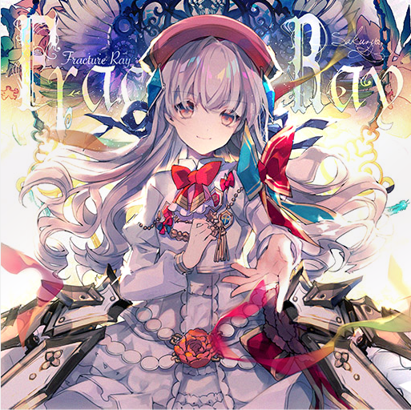

# 信号与系统期中实验报告

专业：计算机科学与技术                                        班级：系统结构

实验题目：用MATLAB进行图像合成             

实验日期：2022年4月19日

## 一、实验目的

* 学会用MATLAB对灰度图像进行傅里叶变换获得频谱
* 用高斯滤波器对频谱进行低通和高通滤波
* 学会对图像频谱进行傅里叶反变换得到原图像，并据此了解不同类型的滤波对图像的影响
* 学会将两张图像合成为一张。试着使用不同的滤波参数，如何才能使得图像的合成效果最好
* 整活，好活烂活都可以整。只要我觉得爽就行（比如肆无忌惮组CP啥的）。

## 二、实验器材

* 笔记本电脑一台，性能足够强大
* MATLAB R2020b

## 三、实验过程

### 1、实验原理

* 本部分讲解一些实验原理和基本方法，最终我们的目的是编写一个函数，可以输入两个图片和滤波相关的参数，就输出一张惊险刺激的照片。这需要以下几个步骤。而且可能会编写多个函数演示中间步骤。
* 以下内容都是基于灰度图的。彩图的后面会想办法。

#### 图像的傅里叶变换

* 要处理图像首先要读入图像，用`imread`命令读入之
* 因为我们只处理灰度图像，所以可以用`rgb2gray`将彩图变成黑白的
* 图像傅里叶变换要求用浮点表示各个像素的灰度，可以用`im2double`函数转化之
* `fft2`函数可以做傅里叶变换。做完以后的矩阵大小和图像矩阵相同。
* `real`函数可以取变换的实部
* 如果希望输出频谱图，最好把频谱做一个对数处理，也即`F‘=log(F+1)`
  * 这个方法可以牺牲部分高频部分的对比度来增加低频部分的对比度

* 这个时候的频谱，低频分量在四个角。有一个`fftshift`函数可以把频谱变成大家熟悉的形式
* 用`imshow`函数可以直接绘制图像，包括原图和频谱图都可以

#### 高斯滤波

* 本来搞滤波是要算卷积的，但是算卷积多么令人郁闷啊！那可怎么办呢？
* 我们知道傅里叶变换具有一个性质，也即卷积性质，描述如下

$$
y(t)=h(t)*x(t)<=>Y(j\omega)=H(j\omega)X(j\omega)
$$

* 事实上对于二维的傅里叶变换，性质是类似的

$$
y(t_1,t_2)=h(t_1,t_2)*x(t_1,t_2)<=>Y(j\omega_1,j\omega_2)=H(j\omega_1,j\omega_2)X(j\omega_1,j\omega_2)
$$

* 高斯低通滤波利用了高斯分布，也即我们将滤波函数写作如下的式子。`d~0~`是可以自选的参数。

$$
H(jw_1,jw_2)=exp(-\frac{\omega_1^2+\omega_2^2}{2d^2_0})
$$

* 下图（网上找的）可以体现出`d~0~`的选取与滤波特性的关系


* 高斯高通滤波大体上是同样的道理

$$
H(jw_1,jw_2)=1-exp(-\frac{\omega_1^2+\omega_2^2}{2d^2_0})
$$

* 那么滤波完了出来大概是个什么效果呢？虽然后面实验做出来就真相大白了，但是我们还是可以先分析一下。一般来讲低频部分是图像灰度变化比较平缓的部分。高频部分是图像灰度变化比较剧烈的部分。那么经过低通滤波处理以后，图像会模糊化。而高通滤波以后图像会锐化。

#### 图像的傅里叶反变换

*  先用`ifftshift`把频谱移回去
*  然后用`ifft2`做傅里叶反变换
*  然后同样需要`real`取实部，然后转为`uint8`(256阶灰度)，就可以画图了

#### 图像的合成

* 做个加法不就行了？

### 2、探究二维傅里叶频谱分解和对数坐标

* 本题会编写一个函数，用来画出一个图像进行傅里叶变换以后的频谱图
* 我们有以下两张图片(512*512)，个人认为清晰度是不错的
  * 以下两图在`source`文件夹中


* 编写函数如下：

```matlab
function [] = GrayGraphFFT(G)
    Fw=fftshift(fft2(im2double(G)));
    R=real(Fw);
    lnR=log(R+1);
    subplot(1,3,1);
    imshow(G);
    title('原始图片');
    subplot(1,3,2);
    imshow(R);
    title('傅里叶频谱');
    subplot(1,3,3);
    imshow(lnR);
    title('对数傅里叶频谱');
end
```

* 输入如下命令
  * WIndows下路径是反斜杠，支持相对路径。


```matlab
>> G1=rgb2gray(imread('.\source\fractureray.jpg'));
>> G2=rgb2gray(imread('.\source\grievouslady.jpg'));
>> GrayGraphFFT(G1);
>> GrayGraphFFT(G2);
```

* 结果如下


* 只能这么说，因为这两张图本身较为复杂，频谱很宽，所以如果不做对数运算，画出来的图就酷似老式电视的雪花点。取对数强调低频部分才能看出频谱特点。
  * In reality,即便取了对数，特点也不是很明显。但是毕竟可以看出来一点了。


### 3、高斯滤波效果探究

* 我们可以非常容易的写出低通滤波和高通滤波的函数，以下是低通滤波函数`GrayGaussLow.m`的代码。
  * 高通滤波代码很类似。
  * 注意那个256*，一开始我没加，然后给我输出漆黑一片的图


```matlab
function [] = GrayGaussLow(G,d0)
    Fw=fftshift(fft2(im2double(G)));
    [M,N]=size(G);
    m_mid=floor(M/2);
    n_mid=floor(N/2);
    H=zeros(M,N);
    for i=1:M
        for j=1:N
            d = ((i-m_mid)^2+(j-n_mid)^2);
            H(i,j) = exp(-(d)/(2*(d0^2)));      
        end
    end
    Fw2=H.*Fw;
    G2=uint8(256*real(ifft2(ifftshift(Fw2))));
    subplot(2,2,1);
    imshow(G);
    title('原始图片');
    subplot(2,2,2);
    imshow(log(Fw+1));
    title('原始对数频谱');
    subplot(2,2,3);
    imshow(G2);
    title('滤波后图片');
    subplot(2,2,4);
    imshow(log(Fw2+1));
    title('滤波后对数频谱');
end
```

* 看一下取不同d0时对第一张图的滤波效果。只截取滤波后图片。

* 低通滤波d0=10(原图见`Fig3.fig`)
  * 果然是高糊画质，因为边缘整个被模糊化了。频谱也只剩一点了。


* 低通滤波d0=25(原图见`Fig4.fig`)
  * 图片清晰度有较明显的提高，频谱范围明显增大。


* 低通滤波d0=50(原图见`Fig5.fig`)
  * 图片清晰度已经较高，但是和原图仍然有明显区别。主要体现一个边缘柔化。


* 高通滤波d0=10(原图见`Fig6.fig`)
  * 看到以后把我自己吓一跳，麻了。要是半夜起床看到这个怕不是直接彻夜不眠。


* 高通滤波d0=25(原图见`Fig7.fig`)
  * 看起来比较像版画，比上面的看起来舒服多了.


* 高通滤波d0=50(原图见`Fig8.fig`)
  * 细节更加丰满，雕刻的更加精致


* 观察以上六个实例，可以发现以下规律：

  * 对于低通滤波，d0很小的时候，得到的就是整个的高糊画质。一般如果希望用低通滤波实现降噪等功能，一般d0要大一些。比如50这样的值。这样可以模糊化一些小的噪点。如果是模糊（或者说柔化）边缘则适当小些，30左右。

  * 对于高通滤波，d0很小的时候(实测需要小于1)，可以实现锐化（见下图为d0=0.5，原图见Fig9.fig,可以发现图像的边缘变得更加突出）。d0较大的时候只会保留图像边缘，制造出类似于版画的效果。d0不大不小的时候效果宛如鬼片，可以用来惊吓室友、家中的弟弟妹妹等。


### 4、图像合成

* 这个时候其实已经很简单了,以下是函数`GrayFusion.m`的代码
  * 直接做两次操作然后取平均即可,在MATLAB的矩阵运算支持下不要太方便。
  * 注意用`floor`或`ceil`保证其整型特性。这两个在这里是差不多的。

```matlab
function [] = GrayFusion(GLow,GHigh,d0)
    FwLow=fftshift(fft2(im2double(GLow)));
    [M,N]=size(GLow);
    m_mid=floor(M/2);
    n_mid=floor(N/2);
    HLow=zeros(M,N);
    HHigh=zeros(M,N);
    for i=1:M
        for j=1:N
            d = ((i-m_mid)^2+(j-n_mid)^2);
            HLow(i,j) = exp(-(d)/(2*(d0^2)));  
            HHigh(i,j) = 1-HLow(i,j);
        end
    end
    Fw2Low=HLow.*FwLow;
    G2Low=uint8(256*real(ifft2(ifftshift(Fw2Low))));
    FwHigh=fftshift(fft2(im2double(GHigh)));
    Fw2High=HHigh.*FwHigh;
    G2High=uint8(256*real(ifft2(ifftshift(Fw2High))));
    G2=floor((G2Low+G2High)/2);
    imshow(G2);
end
```

* 在G1低通，G2高通的情况下，d0=19的图我比较满意，完整图见`Fig9.fig`


* 在G1高通，G2低通的情况下,d0=31时效果我比较满意(原图见`Fig10.fig`)
  * 可以发现上面的例子我们的d0较小，但是这个例子的d0就较大了，这是为什么？这与两张图的特点有关。可以发现G1总体偏亮且对比度偏高。G2总体偏暗且对比度偏低。
  * 一般来说，对于灰度图像，亮图在这样的合成中都是占有有利的地位的，无论是作为高通部分还是低通部分.因为亮图更容易包含更多更明显的细节。所以一般亮图作为高通部分时就要调高d0，亮图作为低通部分时就要调低d0


## 四、思考题：彩色图像处理

* 从数据结构的角度来看，一个灰度图是一个二维数组，而一个彩色图是一个三维数组。相当于把灰度图的每一个点都变成一个有3个元素的数组。
* 那么只需要一点点小小的改动就可以处理彩色图像了！

### 1、彩色图像滤波器

* 只需要将RGB三个通道分别剥离出来进行处理，最后再合成，就可以进行彩色图像滤波。
  * 函数`ColorGaussLow.m`如下.`ColorGaussHigh.m`是类似的。
  * 里面主要就用到了一个分量提取和合成的方法，这个可以直接看下面，就没必要单独进行介绍了

```matlab
function [] = ColorGaussLow(G0,d0)
    R=G0(:,:,1);			%分量提取
    G=G0(:,:,2);
    B=G0(:,:,3);
    [M,N]=size(R);
    FwR=fftshift(fft2(im2double(R)));
    FwG=fftshift(fft2(im2double(G)));
    FwB=fftshift(fft2(im2double(B)));
    m_mid=floor(M/2);
    n_mid=floor(N/2);
    H=zeros(M,N);
    for i=1:M
        for j=1:N
            d = ((i-m_mid)^2+(j-n_mid)^2);
            H(i,j) = exp(-(d)/(2*(d0^2)));      
        end
    end
    FwR2=H.*FwR;
    FwG2=H.*FwG;
    FwB2=H.*FwB;
    RR=uint8(256*real(ifft2(ifftshift(FwR2))));
    GG=uint8(256*real(ifft2(ifftshift(FwG2))));
    BB=uint8(256*real(ifft2(ifftshift(FwB2))));
    G2(:,:,1)=RR(:,:,1);	%f
    G2(:,:,2)=GG(:,:,1);
    G2(:,:,3)=BB(:,:,1);
    imshow(G2);
end
```

* 在参数的选择上，彩图和灰度图有一些不同。
* 一般来讲对于低通滤波，要取得类似的效果，彩图要比灰度图参数要低一点。因为彩图有三种颜色，而灰度图只有一种颜色。所以彩图有时候会出现某一个颜色分量特别大的情况，会单方面让我们觉得更清晰。
* 一个常见的彩色转灰度公式：`Gray=0.299*Red+0.587*Green+0.114*Blue`，是RGB三个分量的加权平均数值。
  * 因为绿色在大部分人看来远远比红色和蓝色亮，而红色又比蓝色亮一些，所以就取了这样的权重。
* 以下分别是d0=10，25，50下低通和高通滤波的画面。最下方附有两张高通滤波d0=0.5和3的图片。没办法太好看了。
  * 彩色图像进行高通滤波时对于各个d0都可以产生令人赞叹的优美效果。
  * 在d0很低时，图片变得十分鲜艳，每一个细节都细致无比。
  * d0稍高时则酷似小时候玩的闪卡(那个时候有张闪卡可牛逼了）。
  * 在d0更高时则酷似夜空的灯光（和黑白图那个幽灵效果完全是两回事）。
  * d0很高时则类似于极细的彩色记号笔画出来的画。不行我忍不住了太好看了。
  * 低通滤波则仍然造成模糊化效果。在合适的d0下可以起到柔化效果。
  * 这些图片保存为`Fig11.jpg`~`Fig18.jpg`

| d0   | 低通滤波                                                     | 高通滤波                                                     |
| ---- | ------------------------------------------------------------ | ------------------------------------------------------------ |
| 10   |  |  |
| 25   |  |  |
| 50   |  |  |



#### 2、彩色图像合成

* 方法是相似的。函数`ColorFusion.m`如下

```matlab
function [] = ColorFusion(G0Low,G0High,d0)
    RLow=G0Low(:,:,1);
    GLow=G0Low(:,:,2);
    BLow=G0Low(:,:,3);
    [M,N]=size(RLow);
    FwRLow=fftshift(fft2(im2double(RLow)));
    FwGLow=fftshift(fft2(im2double(GLow)));
    FwBLow=fftshift(fft2(im2double(BLow)));
    m_mid=floor(M/2);
    n_mid=floor(N/2);
    HLow=zeros(M,N);
    HHigh=zeros(M,N);
    for i=1:M
        for j=1:N
            d = ((i-m_mid)^2+(j-n_mid)^2);
            HLow(i,j) =exp(-(d)/(2*(d0^2)));     
            HHigh(i,j) =1-HLow(i,j);    
        end
    end
    FwR2Low=HLow.*FwRLow;
    FwG2Low=HLow.*FwGLow;
    FwB2Low=HLow.*FwBLow;
    RRLow=uint8(256*real(ifft2(ifftshift(FwR2Low))));
    GGLow=uint8(256*real(ifft2(ifftshift(FwG2Low))));
    BBLow=uint8(256*real(ifft2(ifftshift(FwB2Low))));
    G2Low(:,:,1)=RRLow(:,:,1);
    G2Low(:,:,2)=GGLow(:,:,1);
    G2Low(:,:,3)=BBLow(:,:,1);
    RHigh=G0High(:,:,1);
    GHigh=G0High(:,:,2);
    BHigh=G0High(:,:,3);
    FwRHigh=fftshift(fft2(im2double(RHigh)));
    FwGHigh=fftshift(fft2(im2double(GHigh)));
    FwBHigh=fftshift(fft2(im2double(BHigh)));
    FwR2High=HHigh.*FwRHigh;
    FwG2High=HHigh.*FwGHigh;
    FwB2High=HHigh.*FwBHigh;
    RRHigh=uint8(256*real(ifft2(ifftshift(FwR2High))));
    GGHigh=uint8(256*real(ifft2(ifftshift(FwG2High))));
    BBHigh=uint8(256*real(ifft2(ifftshift(FwB2High))));
    G2High(:,:,1)=RRHigh(:,:,1);
    G2High(:,:,2)=GGHigh(:,:,1);
    G2High(:,:,3)=BBHigh(:,:,1);
    G2=floor((G2Low+G2High)/2);
    imshow(G2);
end
```

* 一般来说，这两张图片中，G1明显属于鲜艳的亮色，所以在图像合成时对于G2同样是不利的，且彩色图片和灰度图片相比会更加的明显。（也就是说如果是用G1低频+G2高频，那么d0必须更低.)
* 选择G1低通，G2高通，d0=12比较令人满意
  * 受到算法局限性。关于凑近看手这个地方突然红一片这个问题是没有办法解决了，这也是权衡的结果。


* 当G1高通，G2低通时，d0=26效果较好，图片见Fig20.fig
  * 当暗色图片作为背景时，此时作为高频部分的G1反而不太有利，因为整个背景色都被改变了。不过也不能再调低d0了，要不然远观时G2就部分被G1遮住了观感不好。
  * 这里就是彩色图像和黑白图像最大的区别所在。因为黑白图片唯一可以起到作用的就是亮度，在亮度这一方面亮图完全吊打暗图，这是毋庸置疑的。但是对于彩图除了亮度还要考虑颜色，在很暗的背景加持下，会使得高频亮图的颜色变得不明显。这个时候反而必须调低d0使得亮图的比重更大，使得颜色可以被看清楚。但是因为两图风格差异实在巨大，这个问题仍然没有完全解决。（注：对于黑白图，风格差异不会那么明显）


## 五、总结与思考

* 看来以前我完全低估了MATLAB的作用。本来以为这个作业非常难以完成，没想到如此轻松就超额完成了该作业。这点真的大大出乎了我的意料
* 关于参数的选取一定程度要看人。不同人的观感可能不一样。可能我认为好的参数其他人不认为好。
* 希望批改作业的助教不要认出这两张图：）
